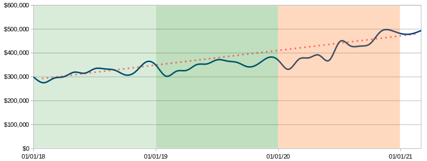
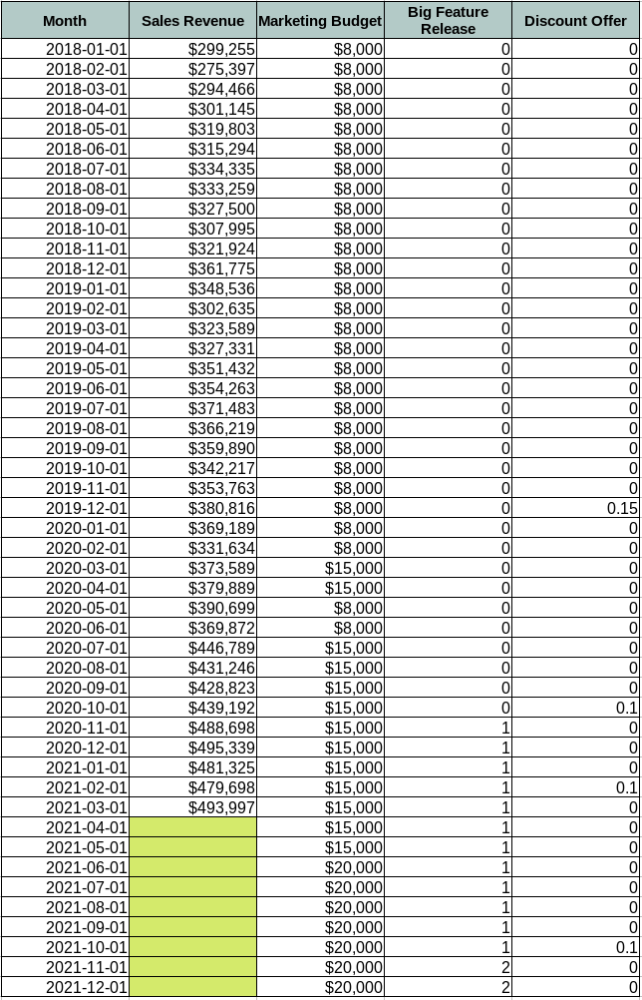
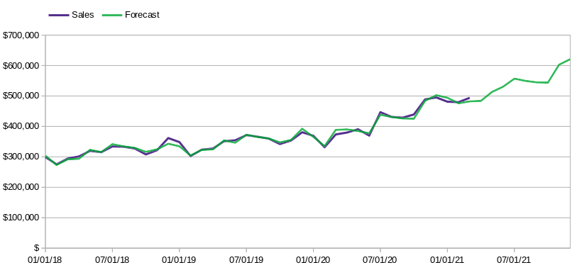

Example of Sales Forecasting
----------

Let's say that a SaaS company asks me to predict their sales for
the remaining months of the year 2021.

As a traditional step, I requested the monthly sales history of
the last 3 years to graph it and analyze the behavior patterns.

As you can see in the previous graph, it was logical to expect
that the received data did not follow a common linear trend,
in fact, it was very interesting to find 2 different patterns.

The first 2 years show a seasonal behavior, while last year a
somewhat erratic behavior, which indicates the need to inquire about
the sales and marketing strategies applied during the past year,
and those planned for the current.

After meeting with the client to discuss the situation, I receive
a spreadsheet with the sales revenue and the main factors that
influence their behavior.

With all the data in hand, I decided to choose the Multiple Linear
Regression mathematical model because it allows me to make predictions
using seasonality and factors as independent variables.

The next step was to develop a PHP script that executes the
mathematical model using the extracted and transformed data.

When I finished, I got a **promising sales forecasting** with a satisfying
**average error rate of 1.5%**. You can see the result in the graph below:

If you want to know more, you can review the following files:

- Input data: `resources/input.csv`
- Script with process details: `src/forecast.php`
- Execution results: `resources/results.csv` (run the script first)
